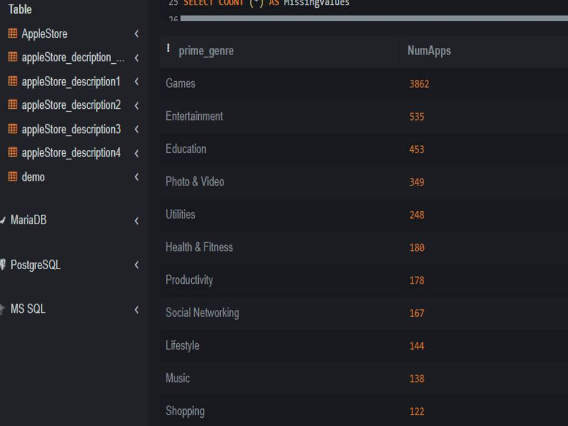
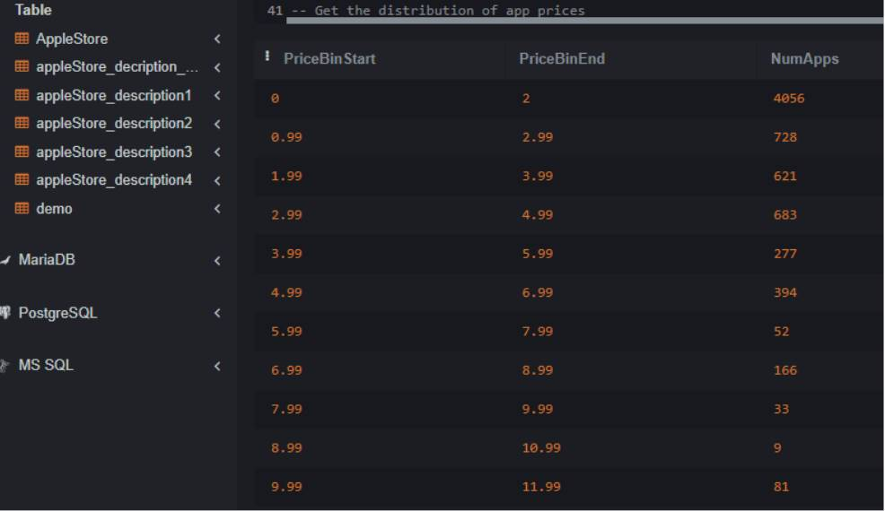
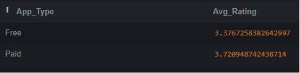
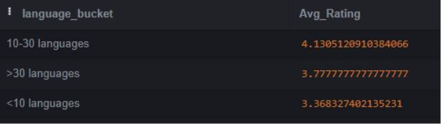
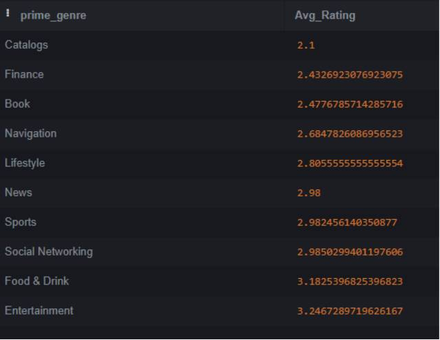
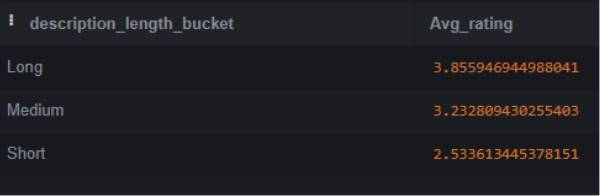
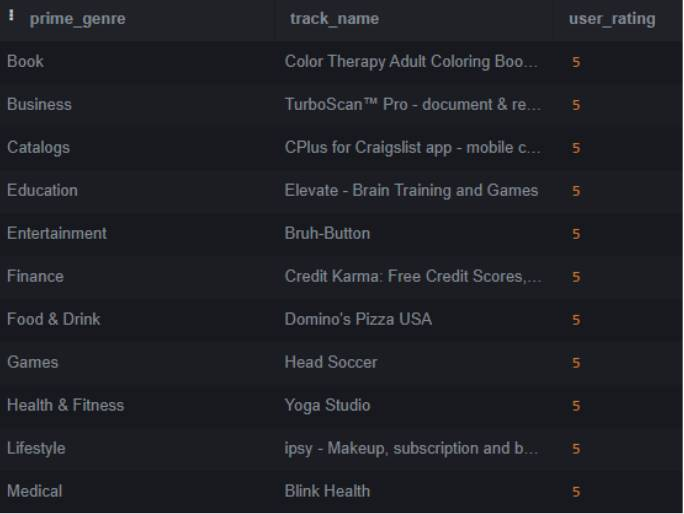

# Apple Store App Analysis using SQLite

### Sahar Simeonov
### Data Scientist
02/29/2024

## Introduction
An aspiring App developer needs data driven insights to decide what type of App to build. As a Data Scientist I intend to derive high-level findings using SQLite platform to give recommendations for what category Apps would have the highest potential for success and market performance.  Our Stakeholder is the new App developer. 
Questions I aim to answer are: 
1.	What App categories are the most popular?
2.	What price should be set?
3.	How can user ratings be maximized?

   
## Datasets
This datasets were obtained from Kaggle and covers information about already existing Apps at Apple store. The data was extracted from the iTunes Search API at the Apple Inc website. The AppleStore.csv dataset has a lot of information including the Apps names, sizing bytes, ratings, supporting devices and supporting languages. The appleStore_description.csv contains an overview of each application description. This is important because the way an App is described tells about its interfaces with its user base and how it might be perceived in the market. 
-	Source - Mobile App Store (7200 apps)
-	Time Period -  July 2017
-	Limitation – Outdated

  
## Connect directly to the Dataset online using SQLite
There are 2 CSV files in this Dataset, the AppleStore.csv and the appleStore_description.csv. SQLite only accepts files that are below 4MB. The appleStore_description.csv is way above that limit so we split this file in to 4 segments under the 4MB limit to upload to SQLite separately. We then join them together using the Union All command in SQLite itself. The 5 different tables are uploaded to SQLite.

CREATE TABLE appleStore_decription_combined AS

SELECT * FROM appleStore_description1

UNION ALL

SELECT * FROM appleStore_description2

UNION ALL

SELECT * FROM appleStore_description3

UNION ALL

SELECT * FROM appleStore_description4

- Now the appleStore_description.csv is joined to its original format.

## Exploratory Data Analysis (EDA)

**Checking the number of unique Apps in both tables to confirm they are matching in terms of the Apps that are being explored.**

SELECT COUNT(DISTINCT id) AS UniqueAppIDs

FROM AppleStore

! UniqueAppIDs

7197  

SELECT COUNT(DISTINCT id) AS UniqueAppIDs

FROM appleStore_decription_combined

! UniqueAppIDs

7197   

- There are no missing Data

  

**Check for any missing Values in key fields like user_rating, name and genre of the App.**

Select Count (*) AS MissingValues

FROM AppleStore

WHERE track_name Is Null OR user_rating IS NULL or prime_genre IS NULL

! MissingValues

0

Select Count (*) AS MissingValues

FROM appleStore_decription_combined

WHERE app_desc Is Null 

! MissingValues

0

- The Data Tables are clean and there are no quality issues.

  

**Check on the number of Apps per genre to get an overview of the distribution in Apple store helping us identify dominant genres**

SELECT prime_genre, COUNT(*) As NumApps

FROM AppleStore

GROUP By prime_genre

ORDER BY NumApps DESC

**Overview of the Apps ratings:**

SELECT 

  min(user_rating) AS MinRating, 
  
  max(user_rating) As MaxRating,
  
  avg(user_rating) AS AvgRating
       
FROM AppleStore

! MinRating
0		 
 
! MaxRating
5
  
! AvgRating
3.526955675976101 

**Get the distribution of App prices**

SELECT
	
 (price/2)*2 As PriceBinStart,
    
  ((price/2)*2)+2 AS PriceBinEnd,
    
  Count(*) AS NumApps

FROM AppleStore

Group By PriceBinStart

ORDER By PriceBinStart

## Data Analysis: Finding Insights for Stakeholder

**Do paid Apps have higher ratings compared to free Apps?**

Select Case 
        
        When price > 0 THEN 'Paid'
        
        ELSE 'Free'
        
        END As App_Type,
        
        avg(user_rating) As Avg_Rating

FROM AppleStore

Group By App_Type

- Paid Apps on average have a slightly higher rating 

**Do Apps with more supportive languages have higher ratings?**

SELECT CASE

	   When lang_num < 10 THEN '<10 languages'
    
            When lang_num BETWEEN 10 and 30 THEN '10-30 languages'
            
            Else '>30 languages'
            
       End As language_bucket,
       
       avg(user_rating) AS Avg_Rating
       
FROM AppleStore

Group By language_bucket

Order BY Avg_Rating DESC

- The middle bucket has the highest rating so we don’t necessarily need to work on so many languages and can focus efforts to other aspects of App creation.

  **Which genres have the lowest ratings?**

SELECT 
      
      prime_genre,

       avg(user_rating) AS Avg_Rating
       
FROM AppleStore

GROUP BY prime_genre

Order By Avg_rating ASC 

LIMIT 10 

- In the Catalogue, Finance and Book categories the users gave bad reviews meaning they were not satisfied and there might be a good opportunity to create an App in this space.

**Is there a correlation between the app description length and user rating?**

SELECT CASE

	    WHEN length(b.app_desc) <500 THEN 'Short'
     
            WHEN length(b.app_desc) BETWEEN 500 AND 1000 THEN 'Medium'
            
            Else 'Long'
            
       END As description_length_bucket,
       
       avg(a.user_rating) AS Avg_rating
       
FROM

    AppleStore aS a 
    
JOIN

    appleStore_decription_combined AS b 
    
on 

   a.id = b.id
   
Group BY description_length_bucket

Order By Avg_rating DESC

- The longer the description the better the App rating

**Which is the top rated app for each genre?**

Select 

    prime_genre,
    
    track_name,
    
    user_rating
    
FROM (

  	SELECT
   
  	 prime_genre,
    
  	 track_name,
    
  	 user_rating,
    
  	  RANK() OVER (PARTITION BY prime_genre ORDER BY user_rating DESC, rating_count_tot DESC) AS rank
     
  	 FROM
    
  	  AppleStore
     
       ) AS a 
       
WHERE 

a.rank=1

## Recommendations

1.	Paid Apps have better ratings. Paid apps generally achieve higher ratings than free apps. This could be due to several reasons one of which could be a higher user engagement and perceived better value. It is recommended to charge for the App.

2.	Apps supporting between 10 -30 languages have better ratings. So it’s not about the quantity of languages that the Apps support but focusing on the right languages for the specific App.

3.	Finance and Book Apps have low ratings! This is a market opportunity were the user needs are not being met and if a quality App can be produced in these categories there is potential for high user ratings and market penetration.

4.	Apps with longer description have better rating. There is positive correlation between App description and user rating. Users likely appreciate having a clear understanding of the Apps features and capabilities before they download. It is recommended to have a detailed well-crafted description of the App can set clear expectations and increase the satisfaction of users.

5.	A new App should aim for an average rating above 3.5 in order to stand out from the crowd.

6.	Games and entertainment have high competition.  These genres have the highest number of Apps suggesting the market may be saturated however shows a high user demands in these sectors.

**If you found this useful or interesting, please don’t forget to comment and up vote. Thank you! 🙂**

